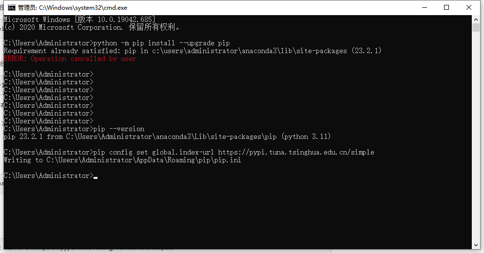

- [Handon-ml3 参考资料](#handon-ml3-参考资料)
  - [1 Git](#1-git)
  - [2 Anaconda](#2-anaconda)
  - [3 Jupyter Notebook](#3-jupyter-notebook)
- [VScode + Anaconda](#vscode--anaconda)

# Handon-ml3 参考资料

https://github.com/ageron/handson-ml3/blob/main/INSTALL.md

## 1 Git

安装Git ： https://blog.csdn.net/qq_38952352/article/details/127656385

https://git-scm.com/download/win

Git-2.42.0.2-64-bit.exe

C:\Program Files\Git

配置环境变量-系统变量Path：C:\Program Files\Git\bin

## 2 Anaconda

https://www.anaconda.com/download

https://mirrors.tuna.tsinghua.edu.cn/anaconda/archive/?C=S&O=D 清华镜像源

Anaconda3-2023.09-Windows-x86_64.exe

https://blog.csdn.net/m0_61607990/article/details/129531686

Path路径手动路径，否则可能会破坏其他软件。

Install Location ： C:\Users\Administrator\anaconda3


conda deactivate 退出环境

$ conda env create -f environment.yml # 创建环境，卡了好久/用时较长



https://www.cnblogs.com/ydthu/p/14383626.html pip网速过慢导致失败，解决方案：清华镜像源

```
D:\GitHub\handson-ml3>activate homl3

(homl3) D:\GitHub\handson-ml3>pip install -r pip.txt
Looking in indexes: https://pypi.tuna.tsinghua.edu.cn/simple
Collecting keras-tuner~=1.1.3 (from -r pip.txt (line 1))
  Downloading https://pypi.tuna.tsinghua.edu.cn/packages/7f/6c/8ac746c9d0e7776bf119c511c98ce10f04e9b9d7c37cb8c0ea226b0968d1/keras_tuner-1.1.3-py3-none-any.whl (135 kB)
     ---------------------------------------- 135.7/135.7 kB 501.8 kB/s eta 0:00:00
Collecting tensorboard-plugin-profile~=2.8.0 (from -r pip.txt (line 2))
  Downloading https://pypi.tuna.tsinghua.edu.cn/packages/69/4c/f55e88b1ddf2865cbd894ecb199d6db04062c6ccf1a81e48572446fc0804/tensorboard_plugin_profile-2.8.0-py3-none-any.whl (5.3 MB)
     ---------------------------------------- 5.3/5.3 MB 1.0 MB/s eta 0:00:00
Collecting tensorboard~=2.10.0 (from -r pip.txt (line 3))
  Downloading https://pypi.tuna.tsinghua.edu.cn/packages/80/49/a5ec29886ef823718c8ae54ed0b3ad7e19066b5bf21cec5038427e6a04c4/tensorboard-2.10.1-py3-none-any.whl (5.9 MB)
     ---------------------------------------- 5.9/5.9 MB 1.1 MB/s eta 0:00:00
Collecting tensorflow-addons~=0.17.1 (from -r pip.txt (line 4))
  Downloading https://pypi.tuna.tsinghua.edu.cn/packages/c4/9d/1842847dc78fcb50c7f558704ed100f13a030d4307209cf028502c1adfeb/tensorflow_addons-0.17.1-cp310-cp310-win_amd64.whl (758 kB)
     ---------------------------------------- 758.1/758.1 kB 1.4 MB/s eta 0:00:00
Collecting tensorflow-datasets~=4.6.0 (from -r pip.txt (line 5))
  Downloading https://pypi.tuna.tsinghua.edu.cn/packages/05/ae/b6efc66bf6276265d813e12a895b05bc3533092d107ca57c8ecbf4c7c963/tensorflow_datasets-4.6.0-py3-none-any.whl (4.3 MB)
     ---------------------------------------- 4.3/4.3 MB 1.7 MB/s eta 0:00:00
Collecting tensorflow-hub~=0.12.0 (from -r pip.txt (line 6))
  Downloading https://pypi.tuna.tsinghua.edu.cn/packages/29/32/899878aa65cae5429f30449cdda61224e3f4319e6a155027bc3af4c3f07b/tensorflow_hub-0.12.0-py2.py3-none-any.whl (108 kB)
     ---------------------------------------- 108.8/108.8 kB 2.1 MB/s eta 0:00:00
Collecting tensorflow-serving-api~=2.10.0 (from -r pip.txt (line 7))
  Downloading https://pypi.tuna.tsinghua.edu.cn/packages/22/88/a976fc1d5820c8c5dfe722a8d1f2a70f3f0a9994dd9b66e1ab8b679958c5/tensorflow_serving_api-2.10.1-py2.py3-none-any.whl (37 kB)
Collecting tensorflow~=2.10.0 (from -r pip.txt (line 8))
  Downloading https://pypi.tuna.tsinghua.edu.cn/packages/ad/87/f484e0b86687c97d2dfb081e03e948b796561fc8608b409a9366e3b4a663/tensorflow-2.10.1-cp310-cp310-win_amd64.whl (455.9 MB)
     ---------------------------------------- 455.9/455.9 MB 1.6 MB/s eta 0:00:00
Collecting transformers~=4.21.3 (from -r pip.txt (line 9))
  Downloading https://pypi.tuna.tsinghua.edu.cn/packages/6a/4a/d35a2140bba25a26b8c8daf74b89f3ab46ad957e998bf77b7b4305187bc5/transformers-4.21.3-py3-none-any.whl (4.7 MB)
     ---------------------------------------- 4.7/4.7 MB 1.5 MB/s eta 0:00:00
Collecting urlextract~=1.6.0 (from -r pip.txt (line 10))
  Downloading https://pypi.tuna.tsinghua.edu.cn/packages/d3/61/321f452c9a3a38532d25fdc15cc22c7cbc4d25de7042f399317a9d536aaa/urlextract-1.6.0-py3-none-any.whl (20 kB)
Collecting gym[accept-rom-license,atari,classic_control]~=0.26.1 (from -r pip.txt (line 11))
  Downloading https://pypi.tuna.tsinghua.edu.cn/packages/ab/b1/eb05a423eb801ab7d0715d6a3b28d92589e30b437052553df19ca2087240/gym-0.26.2.tar.gz (721 kB)
     ---------------------------------------- 721.7/721.7 kB 1.4 MB/s eta 0:00:00
  Installing build dependencies ... done
  Getting requirements to build wheel ... done
  Preparing metadata (pyproject.toml) ... done
Collecting google-cloud-aiplatform~=1.17.0 (from -r pip.txt (line 12))
  Downloading https://pypi.tuna.tsinghua.edu.cn/packages/fd/f8/ed352c668ce33b1119e131aee974f9f8c6bcd987c4a0a95edf3eae913880/google_cloud_aiplatform-1.17.1-py2.py3-none-any.whl (2.3 MB)
     ---------------------------------------- 2.3/2.3 MB 742.6 kB/s eta 0:00:00
Collecting google-cloud-storage~=2.5.0 (from -r pip.txt (line 13))
  Downloading https://pypi.tuna.tsinghua.edu.cn/packages/b3/bf/ae046b7499480a2d84f3385a5abe198122eae338ad224c7f2b6a8a4b48ff/google_cloud_storage-2.5.0-py2.py3-none-any.whl (106 kB)
     ---------------------------------------- 107.0/107.0 kB 2.1 MB/s eta 0:00:00
Requirement already satisfied: packaging in c:\users\administrator\anaconda3\envs\homl3\lib\site-packages (from keras-tuner~=1.1.3->-r pip.txt (line 1)) (23.2)
Requirement already satisfied: numpy in c:\users\administrator\anaconda3\envs\homl3\lib\site-packages (from keras-tuner~=1.1.3->-r pip.txt (line 1)) (1.23.5)
Requirement already satisfied: requests in c:\users\administrator\anaconda3\envs\homl3\lib\site-packages (from keras-tuner~=1.1.3->-r pip.txt (line 1)) (2.28.2)
Requirement already satisfied: ipython in c:\users\administrator\anaconda3\envs\homl3\lib\site-packages (from keras-tuner~=1.1.3->-r pip.txt (line 1)) (8.5.0)
Collecting kt-legacy (from keras-tuner~=1.1.3->-r pip.txt (line 1))
  Downloading https://pypi.tuna.tsinghua.edu.cn/packages/16/53/aca9f36da2516db008017db85a1f3cafaee0efc5fc7a25d94c909651792f/kt_legacy-1.0.5-py3-none-any.whl (9.6 kB)
Collecting gviz-api>=1.9.0 (from tensorboard-plugin-profile~=2.8.0->-r pip.txt (line 2))
  Downloading https://pypi.tuna.tsinghua.edu.cn/packages/67/42/e6ae4f7903f17be07c47b7af1f6d83ec4fe931f373f900f542d737d9940e/gviz_api-1.10.0-py2.py3-none-any.whl (13 kB)
Collecting protobuf>=3.12.0 (from tensorboard-plugin-profile~=2.8.0->-r pip.txt (line 2))
  Downloading https://pypi.tuna.tsinghua.edu.cn/packages/c2/59/f89c04923d68595d359f4cd7adbbdf5e5d791257945f8873d88b2fd1f979/protobuf-4.24.4-cp310-abi3-win_amd64.whl (430 kB)
     ---------------------------------------- 430.5/430.5 kB 1.8 MB/s eta 0:00:00
Requirement already satisfied: setuptools>=41.0.0 in c:\users\administrator\anaconda3\envs\homl3\lib\site-packages (from tensorboard-plugin-profile~=2.8.0->-r pip.txt (line 2)) (68.2.2)
Requirement already satisfied: six>=1.10.0 in c:\users\administrator\anaconda3\envs\homl3\lib\site-packages (from tensorboard-plugin-profile~=2.8.0->-r pip.txt (line 2)) (1.16.0)
Collecting werkzeug>=0.11.15 (from tensorboard-plugin-profile~=2.8.0->-r pip.txt (line 2))
  Downloading https://pypi.tuna.tsinghua.edu.cn/packages/b6/a5/54b01f663d60d5334f6c9c87c26274e94617a4fd463d812463626423b10d/werkzeug-3.0.0-py3-none-any.whl (226 kB)
     ---------------------------------------- 226.6/226.6 kB 2.0 MB/s eta 0:00:00
Collecting absl-py>=0.4 (from tensorboard~=2.10.0->-r pip.txt (line 3))
  Downloading https://pypi.tuna.tsinghua.edu.cn/packages/01/e4/dc0a1dcc4e74e08d7abedab278c795eef54a224363bb18f5692f416d834f/absl_py-2.0.0-py3-none-any.whl (130 kB)
     ---------------------------------------- 130.2/130.2 kB 2.6 MB/s eta 0:00:00
Collecting grpcio>=1.24.3 (from tensorboard~=2.10.0->-r pip.txt (line 3))
  Downloading https://pypi.tuna.tsinghua.edu.cn/packages/c7/40/d43d62a1da2d49700c3defddc307ca4b4e1a405a6ffd5fdacfcb4eea03da/grpcio-1.59.0-cp310-cp310-win_amd64.whl (3.7 MB)
     ---------------------------------------- 3.7/3.7 MB 1.9 MB/s eta 0:00:00
Collecting google-auth<3,>=1.6.3 (from tensorboard~=2.10.0->-r pip.txt (line 3))
  Downloading https://pypi.tuna.tsinghua.edu.cn/packages/39/7c/2e4fa55a99f83ef9ef229ac5d59c44ceb90e2d0145711590c0fa39669f32/google_auth-2.23.3-py2.py3-none-any.whl (182 kB)
     ---------------------------------------- 182.3/182.3 kB 2.2 MB/s eta 0:00:00
Collecting google-auth-oauthlib<0.5,>=0.4.1 (from tensorboard~=2.10.0->-r pip.txt (line 3))
  Downloading https://pypi.tuna.tsinghua.edu.cn/packages/b1/0e/0636cc1448a7abc444fb1b3a63655e294e0d2d49092dc3de05241be6d43c/google_auth_oauthlib-0.4.6-py2.py3-none-any.whl (18 kB)
Collecting markdown>=2.6.8 (from tensorboard~=2.10.0->-r pip.txt (line 3))
  Downloading https://pypi.tuna.tsinghua.edu.cn/packages/bb/c1/50caaec6cadc1c6adc8fe351e03bd646d6e4dd17f55fca0f4c8d7ea8d3e9/Markdown-3.5-py3-none-any.whl (101 kB)
     ---------------------------------------- 101.7/101.7 kB 1.9 MB/s eta 0:00:00
Collecting protobuf>=3.12.0 (from tensorboard-plugin-profile~=2.8.0->-r pip.txt (line 2))
  Downloading https://pypi.tuna.tsinghua.edu.cn/packages/97/f9/a14bac5331f3e55bcbbed906a0c8b112f554152ddf09efeb6f5f95653ffd/protobuf-3.19.6-cp310-cp310-win_amd64.whl (895 kB)
     ---------------------------------------- 895.7/895.7 kB 2.1 MB/s eta 0:00:00
Collecting tensorboard-data-server<0.7.0,>=0.6.0 (from tensorboard~=2.10.0->-r pip.txt (line 3))
  Downloading https://pypi.tuna.tsinghua.edu.cn/packages/74/69/5747a957f95e2e1d252ca41476ae40ce79d70d38151d2e494feb7722860c/tensorboard_data_server-0.6.1-py3-none-any.whl (2.4 kB)
Collecting tensorboard-plugin-wit>=1.6.0 (from tensorboard~=2.10.0->-r pip.txt (line 3))
  Downloading https://pypi.tuna.tsinghua.edu.cn/packages/e0/68/e8ecfac5dd594b676c23a7f07ea34c197d7d69b3313afdf8ac1b0a9905a2/tensorboard_plugin_wit-1.8.1-py3-none-any.whl (781 kB)
     ---------------------------------------- 781.3/781.3 kB 2.1 MB/s eta 0:00:00
Requirement already satisfied: wheel>=0.26 in c:\users\administrator\anaconda3\envs\homl3\lib\site-packages (from tensorboard~=2.10.0->-r pip.txt (line 3)) (0.41.2)
Collecting typeguard>=2.7 (from tensorflow-addons~=0.17.1->-r pip.txt (line 4))
  Downloading https://pypi.tuna.tsinghua.edu.cn/packages/18/01/5fc45558268ced46d86292763477996a3cdd505567cd590a688e8cdc386e/typeguard-4.1.5-py3-none-any.whl (34 kB)
Collecting dill (from tensorflow-datasets~=4.6.0->-r pip.txt (line 5))
  Downloading https://pypi.tuna.tsinghua.edu.cn/packages/f5/3a/74a29b11cf2cdfcd6ba89c0cecd70b37cd1ba7b77978ce611eb7a146a832/dill-0.3.7-py3-none-any.whl (115 kB)
     ---------------------------------------- 115.3/115.3 kB 3.4 MB/s eta 0:00:00
Collecting etils[epath] (from tensorflow-datasets~=4.6.0->-r pip.txt (line 5))
  Downloading https://pypi.tuna.tsinghua.edu.cn/packages/1f/ea/523f2ca226b9f06f57e4c564123b551874ce6268c1e581c4006bc4ad2eae/etils-1.5.1-py3-none-any.whl (140 kB)
     ---------------------------------------- 140.5/140.5 kB 692.8 kB/s eta 0:00:00
Collecting promise (from tensorflow-datasets~=4.6.0->-r pip.txt (line 5))
  Downloading https://pypi.tuna.tsinghua.edu.cn/packages/cf/9c/fb5d48abfe5d791cd496e4242ebcf87a4bb2e0c3dcd6e0ae68c11426a528/promise-2.3.tar.gz (19 kB)
  Preparing metadata (setup.py) ... done
Collecting tensorflow-metadata (from tensorflow-datasets~=4.6.0->-r pip.txt (line 5))
  Downloading https://pypi.tuna.tsinghua.edu.cn/packages/41/23/3705c7139886c079ef4c0e3be56a5a1fb90e9ee413a4b7caaee0ee0ea6fe/tensorflow_metadata-1.14.0-py3-none-any.whl (28 kB)
Collecting termcolor (from tensorflow-datasets~=4.6.0->-r pip.txt (line 5))
  Downloading https://pypi.tuna.tsinghua.edu.cn/packages/67/e1/434566ffce04448192369c1a282931cf4ae593e91907558eaecd2e9f2801/termcolor-2.3.0-py3-none-any.whl (6.9 kB)
Requirement already satisfied: toml in c:\users\administrator\anaconda3\envs\homl3\lib\site-packages (from tensorflow-datasets~=4.6.0->-r pip.txt (line 5)) (0.10.2)
Requirement already satisfied: tqdm in c:\users\administrator\anaconda3\envs\homl3\lib\site-packages (from tensorflow-datasets~=4.6.0->-r pip.txt (line 5)) (4.64.1)
Collecting astunparse>=1.6.0 (from tensorflow~=2.10.0->-r pip.txt (line 8))
  Downloading https://pypi.tuna.tsinghua.edu.cn/packages/2b/03/13dde6512ad7b4557eb792fbcf0c653af6076b81e5941d36ec61f7ce6028/astunparse-1.6.3-py2.py3-none-any.whl (12 kB)
Collecting flatbuffers>=2.0 (from tensorflow~=2.10.0->-r pip.txt (line 8))
  Downloading https://pypi.tuna.tsinghua.edu.cn/packages/6f/12/d5c79ee252793ffe845d58a913197bfa02ae9a0b5c9bc3dc4b58d477b9e7/flatbuffers-23.5.26-py2.py3-none-any.whl (26 kB)
Collecting gast<=0.4.0,>=0.2.1 (from tensorflow~=2.10.0->-r pip.txt (line 8))
  Downloading https://pypi.tuna.tsinghua.edu.cn/packages/b6/48/583c032b79ae5b3daa02225a675aeb673e58d2cb698e78510feceb11958c/gast-0.4.0-py3-none-any.whl (9.8 kB)
Collecting google-pasta>=0.1.1 (from tensorflow~=2.10.0->-r pip.txt (line 8))
  Downloading https://pypi.tuna.tsinghua.edu.cn/packages/a3/de/c648ef6835192e6e2cc03f40b19eeda4382c49b5bafb43d88b931c4c74ac/google_pasta-0.2.0-py3-none-any.whl (57 kB)
     ---------------------------------------- 57.5/57.5 kB 3.0 MB/s eta 0:00:00
Collecting h5py>=2.9.0 (from tensorflow~=2.10.0->-r pip.txt (line 8))
  Downloading https://pypi.tuna.tsinghua.edu.cn/packages/25/5e/2e29933bd1dd67c76b56dd37f5950e6a0cf86ce67e9a9eb6761dac80c031/h5py-3.10.0-cp310-cp310-win_amd64.whl (2.7 MB)
     ---------------------------------------- 2.7/2.7 MB 2.5 MB/s eta 0:00:00
Collecting keras-preprocessing>=1.1.1 (from tensorflow~=2.10.0->-r pip.txt (line 8))
  Downloading https://pypi.tuna.tsinghua.edu.cn/packages/79/4c/7c3275a01e12ef9368a892926ab932b33bb13d55794881e3573482b378a7/Keras_Preprocessing-1.1.2-py2.py3-none-any.whl (42 kB)
     ---------------------------------------- 42.6/42.6 kB 2.2 MB/s eta 0:00:00
Collecting libclang>=13.0.0 (from tensorflow~=2.10.0->-r pip.txt (line 8))
  Downloading https://pypi.tuna.tsinghua.edu.cn/packages/02/8c/dc970bc00867fe290e8c8a7befa1635af716a9ebdfe3fb9dce0ca4b522ce/libclang-16.0.6-py2.py3-none-win_amd64.whl (24.4 MB)
     ---------------------------------------- 24.4/24.4 MB 1.7 MB/s eta 0:00:00
Collecting opt-einsum>=2.3.2 (from tensorflow~=2.10.0->-r pip.txt (line 8))
  Downloading https://pypi.tuna.tsinghua.edu.cn/packages/bc/19/404708a7e54ad2798907210462fd950c3442ea51acc8790f3da48d2bee8b/opt_einsum-3.3.0-py3-none-any.whl (65 kB)
     ---------------------------------------- 65.5/65.5 kB 1.7 MB/s eta 0:00:00
Requirement already satisfied: typing-extensions>=3.6.6 in c:\users\administrator\anaconda3\envs\homl3\lib\site-packages (from tensorflow~=2.10.0->-r pip.txt (line 8)) (4.8.0)
Collecting wrapt>=1.11.0 (from tensorflow~=2.10.0->-r pip.txt (line 8))
  Downloading https://pypi.tuna.tsinghua.edu.cn/packages/a6/32/f4868adc994648fac4cfe347bcc1381c9afcb1602c8ba0910f36b96c5449/wrapt-1.15.0-cp310-cp310-win_amd64.whl (36 kB)
Collecting tensorflow-io-gcs-filesystem>=0.23.1 (from tensorflow~=2.10.0->-r pip.txt (line 8))
  Downloading https://pypi.tuna.tsinghua.edu.cn/packages/78/51/437068ed6b44162d54addb8ac0ddfe9e406d07ac6f9c8a6cf96869ec2262/tensorflow_io_gcs_filesystem-0.31.0-cp310-cp310-win_amd64.whl (1.5 MB)
     ---------------------------------------- 1.5/1.5 MB 1.5 MB/s eta 0:00:00
Collecting tensorflow-estimator<2.11,>=2.10.0 (from tensorflow~=2.10.0->-r pip.txt (line 8))
  Downloading https://pypi.tuna.tsinghua.edu.cn/packages/b6/05/9d7f3a6c783669cba36a6eb4555d0c73a516eee935dde6176dfb8512f94e/tensorflow_estimator-2.10.0-py2.py3-none-any.whl (438 kB)
     ---------------------------------------- 438.7/438.7 kB 2.1 MB/s eta 0:00:00
Collecting keras<2.11,>=2.10.0 (from tensorflow~=2.10.0->-r pip.txt (line 8))
  Downloading https://pypi.tuna.tsinghua.edu.cn/packages/f9/4d/dc255a437c9616b155e5bd55e325e092b7cdcb4652361d733ae051d40853/keras-2.10.0-py2.py3-none-any.whl (1.7 MB)
     ---------------------------------------- 1.7/1.7 MB 2.0 MB/s eta 0:00:00
Collecting filelock (from transformers~=4.21.3->-r pip.txt (line 9))
  Downloading https://pypi.tuna.tsinghua.edu.cn/packages/5e/5d/97afbafd9d584ff1b45fcb354a479a3609bd97f912f8f1f6c563cb1fae21/filelock-3.12.4-py3-none-any.whl (11 kB)
Collecting huggingface-hub<1.0,>=0.1.0 (from transformers~=4.21.3->-r pip.txt (line 9))
  Downloading https://pypi.tuna.tsinghua.edu.cn/packages/ef/b5/b6107bd65fa4c96fdf00e4733e2fe5729bb9e5e09997f63074bb43d3ab28/huggingface_hub-0.18.0-py3-none-any.whl (301 kB)
     ---------------------------------------- 302.0/302.0 kB 2.3 MB/s eta 0:00:00
Collecting pyyaml>=5.1 (from transformers~=4.21.3->-r pip.txt (line 9))
  Downloading https://pypi.tuna.tsinghua.edu.cn/packages/24/97/9b59b43431f98d01806b288532da38099cc6f2fea0f3d712e21e269c0279/PyYAML-6.0.1-cp310-cp310-win_amd64.whl (145 kB)
     ---------------------------------------- 145.3/145.3 kB 1.7 MB/s eta 0:00:00
Requirement already satisfied: regex!=2019.12.17 in c:\users\administrator\anaconda3\envs\homl3\lib\site-packages (from transformers~=4.21.3->-r pip.txt (line 9)) (2023.10.3)
Collecting tokenizers!=0.11.3,<0.13,>=0.11.1 (from transformers~=4.21.3->-r pip.txt (line 9))
  Downloading https://pypi.tuna.tsinghua.edu.cn/packages/30/14/d455b693ea2e3973bb5514c06658035289c33d7010a16f1285a06461e053/tokenizers-0.12.1-cp310-cp310-win_amd64.whl (3.3 MB)
     ---------------------------------------- 3.3/3.3 MB 1.9 MB/s eta 0:00:00
Requirement already satisfied: idna in c:\users\administrator\anaconda3\envs\homl3\lib\site-packages (from urlextract~=1.6.0->-r pip.txt (line 10)) (3.4)
Collecting uritools (from urlextract~=1.6.0->-r pip.txt (line 10))
  Downloading https://pypi.tuna.tsinghua.edu.cn/packages/6b/ff/b16f225ceeb47f5d8899371ce446a8d6c1fe509a8882998b869f2a794c25/uritools-4.0.2-py3-none-any.whl (10 kB)
Requirement already satisfied: platformdirs in c:\users\administrator\anaconda3\envs\homl3\lib\site-packages (from urlextract~=1.6.0->-r pip.txt (line 10)) (3.11.0)
Collecting cloudpickle>=1.2.0 (from gym[accept-rom-license,atari,classic_control]~=0.26.1->-r pip.txt (line 11))
  Downloading https://pypi.tuna.tsinghua.edu.cn/packages/96/43/dae06432d0c4b1dc9e9149ad37b4ca8384cf6eb7700cd9215b177b914f0a/cloudpickle-3.0.0-py3-none-any.whl (20 kB)
Collecting gym-notices>=0.0.4 (from gym[accept-rom-license,atari,classic_control]~=0.26.1->-r pip.txt (line 11))
  Downloading https://pypi.tuna.tsinghua.edu.cn/packages/25/26/d786c6bec30fe6110fd3d22c9a273a2a0e56c0b73b93e25ea1af5a53243b/gym_notices-0.0.8-py3-none-any.whl (3.0 kB)
Collecting pygame==2.1.0 (from gym[accept-rom-license,atari,classic_control]~=0.26.1->-r pip.txt (line 11))
  Downloading https://pypi.tuna.tsinghua.edu.cn/packages/e0/ce/1215d864989d25cb7b234759ce6a760813dffe2e707df7f8e3e748538ba0/pygame-2.1.0-cp310-cp310-win_amd64.whl (4.8 MB)
     ---------------------------------------- 4.8/4.8 MB 1.6 MB/s eta 0:00:00
Collecting ale-py~=0.8.0 (from gym[accept-rom-license,atari,classic_control]~=0.26.1->-r pip.txt (line 11))
  Downloading https://pypi.tuna.tsinghua.edu.cn/packages/8d/2d/3084ab21dab8b35f7be6e762fc7dd7651971b87cf58a8e1a1b1c2975b616/ale_py-0.8.1-cp310-cp310-win_amd64.whl (952 kB)
     ---------------------------------------- 952.4/952.4 kB 2.4 MB/s eta 0:00:00
Collecting autorom[accept-rom-license]~=0.4.2 (from gym[accept-rom-license,atari,classic_control]~=0.26.1->-r pip.txt (line 11))
  Downloading https://pypi.tuna.tsinghua.edu.cn/packages/83/aa/e2695fa0c93b39cfe2065fcd189e7eb2db88f6e0922e932fc615827070da/AutoROM-0.4.2-py3-none-any.whl (16 kB)
Collecting google-api-core[grpc]!=2.0.*,!=2.1.*,!=2.2.*,!=2.3.*,!=2.4.*,!=2.5.*,!=2.6.*,!=2.7.*,<3.0.0dev,>=1.32.0 (from google-cloud-aiplatform~=1.17.0->-r pip.txt (line 12))
  Downloading https://pypi.tuna.tsinghua.edu.cn/packages/4d/ce/4fd62ea66b3508debc795e475336ce915929765870f0ad52328426ba016e/google_api_core-2.12.0-py3-none-any.whl (121 kB)
     ---------------------------------------- 121.4/121.4 kB 2.4 MB/s eta 0:00:00
Collecting proto-plus<2.0.0dev,>=1.22.0 (from google-cloud-aiplatform~=1.17.0->-r pip.txt (line 12))
  Downloading https://pypi.tuna.tsinghua.edu.cn/packages/36/5b/e02636d221917d6fa2a61289b3f16002eb4c93d51c0191ac8e896d527182/proto_plus-1.22.3-py3-none-any.whl (48 kB)
     ---------------------------------------- 48.1/48.1 kB 1.2 MB/s eta 0:00:00
Collecting packaging (from keras-tuner~=1.1.3->-r pip.txt (line 1))
  Downloading https://pypi.tuna.tsinghua.edu.cn/packages/05/8e/8de486cbd03baba4deef4142bd643a3e7bbe954a784dc1bb17142572d127/packaging-21.3-py3-none-any.whl (40 kB)
     ---------------------------------------- 40.8/40.8 kB 2.0 MB/s eta 0:00:00
Collecting google-cloud-bigquery<3.0.0dev,>=1.15.0 (from google-cloud-aiplatform~=1.17.0->-r pip.txt (line 12))
  Downloading https://pypi.tuna.tsinghua.edu.cn/packages/07/ac/a17f4056b3e2427c478e07015f4d5ffe68cd376598b921618fd4cc35d0e4/google_cloud_bigquery-2.34.4-py2.py3-none-any.whl (206 kB)
     ---------------------------------------- 206.6/206.6 kB 1.8 MB/s eta 0:00:00
Collecting google-cloud-resource-manager<3.0.0dev,>=1.3.3 (from google-cloud-aiplatform~=1.17.0->-r pip.txt (line 12))
  Downloading https://pypi.tuna.tsinghua.edu.cn/packages/8b/9c/6807473e69fddc9bf33413b7db966fbcfeb0deade2f5ed324cef2b98ec16/google_cloud_resource_manager-1.10.4-py2.py3-none-any.whl (320 kB)
     ---------------------------------------- 321.0/321.0 kB 2.0 MB/s eta 0:00:00
Collecting google-cloud-core<3.0dev,>=2.3.0 (from google-cloud-storage~=2.5.0->-r pip.txt (line 13))
  Downloading https://pypi.tuna.tsinghua.edu.cn/packages/a2/40/02045f776fdb6e44194f34b6375a26ce8a61bd9bd03cd8930ed91cf51a62/google_cloud_core-2.3.3-py2.py3-none-any.whl (29 kB)
Collecting google-resumable-media>=2.3.2 (from google-cloud-storage~=2.5.0->-r pip.txt (line 13))
  Downloading https://pypi.tuna.tsinghua.edu.cn/packages/c7/4f/b8e5e22406e5aeafa46df8799939d5eeee52f18eeed339675167fac6603a/google_resumable_media-2.6.0-py2.py3-none-any.whl (80 kB)
     ---------------------------------------- 80.3/80.3 kB 1.5 MB/s eta 0:00:00
Requirement already satisfied: importlib-resources in c:\users\administrator\anaconda3\envs\homl3\lib\site-packages (from ale-py~=0.8.0->gym[accept-rom-license,atari,classic_control]~=0.26.1->-r pip.txt (line 11)) (6.1.0)
Requirement already satisfied: click in c:\users\administrator\anaconda3\envs\homl3\lib\site-packages (from autorom[accept-rom-license]~=0.4.2->gym[accept-rom-license,atari,classic_control]~=0.26.1->-r pip.txt (line 11)) (8.1.7)
Collecting AutoROM.accept-rom-license (from autorom[accept-rom-license]~=0.4.2->gym[accept-rom-license,atari,classic_control]~=0.26.1->-r pip.txt (line 11))
  Downloading https://pypi.tuna.tsinghua.edu.cn/packages/a1/67/cc207fe30615001ce713e58dd975124985dc6f7e5ac1141f8bb342ebf3fe/AutoROM.accept-rom-license-0.6.1.tar.gz (434 kB)
     ---------------------------------------- 434.7/434.7 kB 1.8 MB/s eta 0:00:00
  Installing build dependencies ... done
  Getting requirements to build wheel ... done
  Preparing metadata (pyproject.toml) ... done
Collecting googleapis-common-protos<2.0.dev0,>=1.56.2 (from google-api-core[grpc]!=2.0.*,!=2.1.*,!=2.2.*,!=2.3.*,!=2.4.*,!=2.5.*,!=2.6.*,!=2.7.*,<3.0.0dev,>=1.32.0->google-cloud-aiplatform~=1.17.0->-r pip.txt (line 12))
  Downloading https://pypi.tuna.tsinghua.edu.cn/packages/21/49/12996dc0238e017504dceea1d121a48bd49fb3f4416f40d59fc3e924b4f3/googleapis_common_protos-1.61.0-py2.py3-none-any.whl (230 kB)
     ---------------------------------------- 230.9/230.9 kB 1.8 MB/s eta 0:00:00
Collecting grpcio-status<2.0.dev0,>=1.33.2 (from google-api-core[grpc]!=2.0.*,!=2.1.*,!=2.2.*,!=2.3.*,!=2.4.*,!=2.5.*,!=2.6.*,!=2.7.*,<3.0.0dev,>=1.32.0->google-cloud-aiplatform~=1.17.0->-r pip.txt (line 12))
  Downloading https://pypi.tuna.tsinghua.edu.cn/packages/55/ce/e6d0382610240439ced22fe2183bcc387946bf80e5e0f17f5b5250978ff3/grpcio_status-1.59.0-py3-none-any.whl (14 kB)
Collecting cachetools<6.0,>=2.0.0 (from google-auth<3,>=1.6.3->tensorboard~=2.10.0->-r pip.txt (line 3))
  Downloading https://pypi.tuna.tsinghua.edu.cn/packages/a9/c9/c8a7710f2cedcb1db9224fdd4d8307c9e48cbddc46c18b515fefc0f1abbe/cachetools-5.3.1-py3-none-any.whl (9.3 kB)
Collecting pyasn1-modules>=0.2.1 (from google-auth<3,>=1.6.3->tensorboard~=2.10.0->-r pip.txt (line 3))
  Downloading https://pypi.tuna.tsinghua.edu.cn/packages/cd/8e/bea464350e1b8c6ed0da3a312659cb648804a08af6cacc6435867f74f8bd/pyasn1_modules-0.3.0-py2.py3-none-any.whl (181 kB)
     ---------------------------------------- 181.3/181.3 kB 994.6 kB/s eta 0:00:00
Collecting rsa<5,>=3.1.4 (from google-auth<3,>=1.6.3->tensorboard~=2.10.0->-r pip.txt (line 3))
  Downloading https://pypi.tuna.tsinghua.edu.cn/packages/49/97/fa78e3d2f65c02c8e1268b9aba606569fe97f6c8f7c2d74394553347c145/rsa-4.9-py3-none-any.whl (34 kB)
Collecting requests-oauthlib>=0.7.0 (from google-auth-oauthlib<0.5,>=0.4.1->tensorboard~=2.10.0->-r pip.txt (line 3))
  Downloading https://pypi.tuna.tsinghua.edu.cn/packages/6f/bb/5deac77a9af870143c684ab46a7934038a53eb4aa975bc0687ed6ca2c610/requests_oauthlib-1.3.1-py2.py3-none-any.whl (23 kB)
Requirement already satisfied: python-dateutil<3.0dev,>=2.7.2 in c:\users\administrator\anaconda3\envs\homl3\lib\site-packages (from google-cloud-bigquery<3.0.0dev,>=1.15.0->google-cloud-aiplatform~=1.17.0->-r pip.txt (line 12)) (2.8.2)
Collecting grpc-google-iam-v1<1.0.0dev,>=0.12.4 (from google-cloud-resource-manager<3.0.0dev,>=1.3.3->google-cloud-aiplatform~=1.17.0->-r pip.txt (line 12))
  Downloading https://pypi.tuna.tsinghua.edu.cn/packages/34/72/c84e54991d452942c5a85474693c8433169104a596e9dd23b05c5f091894/grpc_google_iam_v1-0.12.6-py2.py3-none-any.whl (26 kB)
Collecting google-crc32c<2.0dev,>=1.0 (from google-resumable-media>=2.3.2->google-cloud-storage~=2.5.0->-r pip.txt (line 13))
  Downloading https://pypi.tuna.tsinghua.edu.cn/packages/1f/6b/fcd4744a020fa7bfb1a451b0be22b3e5a4cb28bafaaf01467d2e9402b96b/google_crc32c-1.5.0-cp310-cp310-win_amd64.whl (27 kB)
Collecting fsspec>=2023.5.0 (from huggingface-hub<1.0,>=0.1.0->transformers~=4.21.3->-r pip.txt (line 9))
  Downloading https://pypi.tuna.tsinghua.edu.cn/packages/fe/d3/e1aa96437d944fbb9cc95d0316e25583886e9cd9e6adc07baad943524eda/fsspec-2023.9.2-py3-none-any.whl (173 kB)
     ---------------------------------------- 173.4/173.4 kB 2.1 MB/s eta 0:00:00
Requirement already satisfied: pyparsing!=3.0.5,>=2.0.2 in c:\users\administrator\anaconda3\envs\homl3\lib\site-packages (from packaging->keras-tuner~=1.1.3->-r pip.txt (line 1)) (3.1.1)
Requirement already satisfied: charset-normalizer<4,>=2 in c:\users\administrator\anaconda3\envs\homl3\lib\site-packages (from requests->keras-tuner~=1.1.3->-r pip.txt (line 1)) (3.3.0)
Requirement already satisfied: urllib3<1.27,>=1.21.1 in c:\users\administrator\anaconda3\envs\homl3\lib\site-packages (from requests->keras-tuner~=1.1.3->-r pip.txt (line 1)) (1.26.17)
Requirement already satisfied: certifi>=2017.4.17 in c:\users\administrator\anaconda3\envs\homl3\lib\site-packages (from requests->keras-tuner~=1.1.3->-r pip.txt (line 1)) (2023.7.22)
Requirement already satisfied: colorama in c:\users\administrator\anaconda3\envs\homl3\lib\site-packages (from tqdm->tensorflow-datasets~=4.6.0->-r pip.txt (line 5)) (0.4.6)
Requirement already satisfied: MarkupSafe>=2.1.1 in c:\users\administrator\anaconda3\envs\homl3\lib\site-packages (from werkzeug>=0.11.15->tensorboard-plugin-profile~=2.8.0->-r pip.txt (line 2)) (2.1.3)
Requirement already satisfied: zipp in c:\users\administrator\anaconda3\envs\homl3\lib\site-packages (from etils[epath]->tensorflow-datasets~=4.6.0->-r pip.txt (line 5)) (3.17.0)
Requirement already satisfied: backcall in c:\users\administrator\anaconda3\envs\homl3\lib\site-packages (from ipython->keras-tuner~=1.1.3->-r pip.txt (line 1)) (0.2.0)
Requirement already satisfied: decorator in c:\users\administrator\anaconda3\envs\homl3\lib\site-packages (from ipython->keras-tuner~=1.1.3->-r pip.txt (line 1)) (5.1.1)
Requirement already satisfied: jedi>=0.16 in c:\users\administrator\anaconda3\envs\homl3\lib\site-packages (from ipython->keras-tuner~=1.1.3->-r pip.txt (line 1)) (0.19.1)
Requirement already satisfied: matplotlib-inline in c:\users\administrator\anaconda3\envs\homl3\lib\site-packages (from ipython->keras-tuner~=1.1.3->-r pip.txt (line 1)) (0.1.6)
Requirement already satisfied: pickleshare in c:\users\administrator\anaconda3\envs\homl3\lib\site-packages (from ipython->keras-tuner~=1.1.3->-r pip.txt (line 1)) (0.7.5)
Requirement already satisfied: prompt-toolkit<3.1.0,>3.0.1 in c:\users\administrator\anaconda3\envs\homl3\lib\site-packages (from ipython->keras-tuner~=1.1.3->-r pip.txt (line 1)) (3.0.39)
Requirement already satisfied: pygments>=2.4.0 in c:\users\administrator\anaconda3\envs\homl3\lib\site-packages (from ipython->keras-tuner~=1.1.3->-r pip.txt (line 1)) (2.16.1)
Requirement already satisfied: stack-data in c:\users\administrator\anaconda3\envs\homl3\lib\site-packages (from ipython->keras-tuner~=1.1.3->-r pip.txt (line 1)) (0.6.2)
Requirement already satisfied: traitlets>=5 in c:\users\administrator\anaconda3\envs\homl3\lib\site-packages (from ipython->keras-tuner~=1.1.3->-r pip.txt (line 1)) (5.9.0)
Collecting absl-py>=0.4 (from tensorboard~=2.10.0->-r pip.txt (line 3))
  Downloading https://pypi.tuna.tsinghua.edu.cn/packages/dd/87/de5c32fa1b1c6c3305d576e299801d8655c175ca9557019906247b994331/absl_py-1.4.0-py3-none-any.whl (126 kB)
     ---------------------------------------- 126.5/126.5 kB 1.8 MB/s eta 0:00:00
INFO: pip is looking at multiple versions of tensorflow-metadata to determine which version is compatible with other requirements. This could take a while.
Collecting tensorflow-metadata (from tensorflow-datasets~=4.6.0->-r pip.txt (line 5))
  Downloading https://pypi.tuna.tsinghua.edu.cn/packages/6e/b7/41ed520712c659dee0653dbd1ae71ed991bc51c7622e3e4dafbbf208faaa/tensorflow_metadata-1.13.1-py3-none-any.whl (28 kB)
  Downloading https://pypi.tuna.tsinghua.edu.cn/packages/1d/7a/29b68133e47b46c960d3bcdfdc3bc9e479303d0ce827867006908c2320c1/tensorflow_metadata-1.13.0-py3-none-any.whl (53 kB)
     ---------------------------------------- 53.3/53.3 kB 1.3 MB/s eta 0:00:00
INFO: pip is looking at multiple versions of grpcio-status to determine which version is compatible with other requirements. This could take a while.
Collecting grpcio-status<2.0.dev0,>=1.33.2 (from google-api-core[grpc]!=2.0.*,!=2.1.*,!=2.2.*,!=2.3.*,!=2.4.*,!=2.5.*,!=2.6.*,!=2.7.*,<3.0.0dev,>=1.32.0->google-cloud-aiplatform~=1.17.0->-r pip.txt (line 12))
  Downloading https://pypi.tuna.tsinghua.edu.cn/packages/f6/48/2bcf11bc2df159564eac099ea38d80663d291a56fa2f2f561d08bf083dfa/grpcio_status-1.58.0-py3-none-any.whl (14 kB)
  Downloading https://pypi.tuna.tsinghua.edu.cn/packages/d0/3f/347d93056572fdbd64d4f0fc58a18d420763a7118f8b177437d9dab0ae6f/grpcio_status-1.57.0-py3-none-any.whl (5.1 kB)
  Downloading https://pypi.tuna.tsinghua.edu.cn/packages/ef/16/3018689d96918e9c4c7407adf96b721df4d6748ba65db82c5eaa63564335/grpcio_status-1.56.2-py3-none-any.whl (5.1 kB)
  Downloading https://pypi.tuna.tsinghua.edu.cn/packages/2b/21/aaff30111c5941fd9adb5abbf06e04a0e491a685f48ffb291f72ad595ec7/grpcio_status-1.56.0-py3-none-any.whl (5.1 kB)
  Downloading https://pypi.tuna.tsinghua.edu.cn/packages/b6/c8/0efd0cf1ff62b3acc28619b9ba80a6ead4eb0ee42bb1c3b3841610af98a7/grpcio_status-1.55.3-py3-none-any.whl (5.1 kB)
  Downloading https://pypi.tuna.tsinghua.edu.cn/packages/b9/ad/51cf59eb26ffa5360ba9dc318580b777e5dda1aa344ad34475103d97e5ac/grpcio_status-1.54.3-py3-none-any.whl (5.1 kB)
  Downloading https://pypi.tuna.tsinghua.edu.cn/packages/5f/06/19520e0c6ab22fe09a0c8cfeabdf63b1ce6ea5d6ac88a65a2fa57b080976/grpcio_status-1.54.2-py3-none-any.whl (5.1 kB)
INFO: pip is still looking at multiple versions of grpcio-status to determine which version is compatible with other requirements. This could take a while.
  Downloading https://pypi.tuna.tsinghua.edu.cn/packages/d0/b5/ce78c4c0ebe6943a79d669b2971bd6ebaebae8dde3ca81814436ab00a583/grpcio_status-1.54.0-py3-none-any.whl (5.1 kB)
  Downloading https://pypi.tuna.tsinghua.edu.cn/packages/fb/c0/8ee53675cb1aecaa7fcbc9bea6575cb8c19a21dd0ce80fe6e5edb04426f4/grpcio_status-1.53.2-py3-none-any.whl (5.1 kB)
  Downloading https://pypi.tuna.tsinghua.edu.cn/packages/61/14/6a4476403abaf954c0b5715de9cfdb7528143c5ac372316fa95704ae8551/grpcio_status-1.53.1-py3-none-any.whl (5.1 kB)
  Downloading https://pypi.tuna.tsinghua.edu.cn/packages/8e/a7/54f2404c17bbed0af2e60028b5310fd195ec0693a98098766668fa69e44e/grpcio_status-1.53.0-py3-none-any.whl (5.1 kB)
  Downloading https://pypi.tuna.tsinghua.edu.cn/packages/cf/06/93caa3804c8b129772662812925a055ae47c56b037e6554cac91a50094de/grpcio_status-1.51.3-py3-none-any.whl (5.1 kB)
INFO: This is taking longer than usual. You might need to provide the dependency resolver with stricter constraints to reduce runtime. See https://pip.pypa.io/warnings/backtracking for guidance. If you want to abort this run, press Ctrl + C.
  Downloading https://pypi.tuna.tsinghua.edu.cn/packages/2d/86/681b847854f6702e32231a8e60ed6918c3d24173efdfb71c30afbb5599f1/grpcio_status-1.51.1-py3-none-any.whl (5.1 kB)
  Downloading https://pypi.tuna.tsinghua.edu.cn/packages/5b/d7/874a4443274d2082624a20e81af798418531d4c79d88dd67416c8d083695/grpcio_status-1.50.0-py3-none-any.whl (14 kB)
  Downloading https://pypi.tuna.tsinghua.edu.cn/packages/2e/33/e88da69f7ac4cabac52b6242ae84d8a02852034cc388951938020c5f90ec/grpcio_status-1.49.1-py3-none-any.whl (14 kB)
  Downloading https://pypi.tuna.tsinghua.edu.cn/packages/14/32/754cd4474790239c7436a7a9490bc0c4a0a2ed604cb9a940151a3b1055b9/grpcio_status-1.48.2-py3-none-any.whl (14 kB)
Requirement already satisfied: parso<0.9.0,>=0.8.3 in c:\users\administrator\anaconda3\envs\homl3\lib\site-packages (from jedi>=0.16->ipython->keras-tuner~=1.1.3->-r pip.txt (line 1)) (0.8.3)
Requirement already satisfied: wcwidth in c:\users\administrator\anaconda3\envs\homl3\lib\site-packages (from prompt-toolkit<3.1.0,>3.0.1->ipython->keras-tuner~=1.1.3->-r pip.txt (line 1)) (0.2.8)
Collecting pyasn1<0.6.0,>=0.4.6 (from pyasn1-modules>=0.2.1->google-auth<3,>=1.6.3->tensorboard~=2.10.0->-r pip.txt (line 3))
  Downloading https://pypi.tuna.tsinghua.edu.cn/packages/14/e5/b56a725cbde139aa960c26a1a3ca4d4af437282e20b5314ee6a3501e7dfc/pyasn1-0.5.0-py2.py3-none-any.whl (83 kB)
     ---------------------------------------- 83.9/83.9 kB 2.4 MB/s eta 0:00:00
Collecting oauthlib>=3.0.0 (from requests-oauthlib>=0.7.0->google-auth-oauthlib<0.5,>=0.4.1->tensorboard~=2.10.0->-r pip.txt (line 3))
  Downloading https://pypi.tuna.tsinghua.edu.cn/packages/7e/80/cab10959dc1faead58dc8384a781dfbf93cb4d33d50988f7a69f1b7c9bbe/oauthlib-3.2.2-py3-none-any.whl (151 kB)
     ---------------------------------------- 151.7/151.7 kB 2.3 MB/s eta 0:00:00
Requirement already satisfied: executing>=1.2.0 in c:\users\administrator\anaconda3\envs\homl3\lib\site-packages (from stack-data->ipython->keras-tuner~=1.1.3->-r pip.txt (line 1)) (1.2.0)
Requirement already satisfied: asttokens>=2.1.0 in c:\users\administrator\anaconda3\envs\homl3\lib\site-packages (from stack-data->ipython->keras-tuner~=1.1.3->-r pip.txt (line 1)) (2.4.0)
Requirement already satisfied: pure-eval in c:\users\administrator\anaconda3\envs\homl3\lib\site-packages (from stack-data->ipython->keras-tuner~=1.1.3->-r pip.txt (line 1)) (0.2.2)
Building wheels for collected packages: gym, promise, AutoROM.accept-rom-license
  Building wheel for gym (pyproject.toml) ... done
  Created wheel for gym: filename=gym-0.26.2-py3-none-any.whl size=827633 sha256=35fc7f9a5582ac2461eba8db9ddd5b98e911f7e2826d357226878052289356fa
  Stored in directory: c:\users\administrator\appdata\local\pip\cache\wheels\77\59\be\835c44599292a3abed875fc29b60dd489b8df8bc69c6103970
  Building wheel for promise (setup.py) ... done
  Created wheel for promise: filename=promise-2.3-py3-none-any.whl size=21545 sha256=ed9ec40be856e240150f138e638f81762ca7fb596e2c5174e18f5b3d525b794a
  Stored in directory: c:\users\administrator\appdata\local\pip\cache\wheels\20\b9\90\16421f72979d1255e08f1f5c2edf0635d80ea5e25788c7fb90
  Building wheel for AutoROM.accept-rom-license (pyproject.toml) ... done
  Created wheel for AutoROM.accept-rom-license: filename=AutoROM.accept_rom_license-0.6.1-py3-none-any.whl size=446680 sha256=8ebc167f3c6fcd0d430cdd57bc9c1da1bcc84861527b376adf2ce6d3ba7975b0
  Stored in directory: c:\users\administrator\appdata\local\pip\cache\wheels\80\23\dc\99115e301e2def20606e7738b524e7ddaeaf1ae3032bb1a80f
Successfully built gym promise AutoROM.accept-rom-license
Installing collected packages: tokenizers, tensorboard-plugin-wit, libclang, kt-legacy, keras, gym-notices, flatbuffers, wrapt, werkzeug, uritools, typeguard, termcolor, tensorflow-io-gcs-filesystem, tensorflow-estimator, tensorboard-data-server, pyyaml, pygame, pyasn1, protobuf, promise, packaging, opt-einsum, oauthlib, markdown, keras-preprocessing, h5py, gviz-api, grpcio, google-pasta, google-crc32c, gast, fsspec, filelock, etils, dill, cloudpickle, cachetools, astunparse, ale-py, absl-py, urlextract, tensorflow-hub, tensorflow-addons, tensorboard-plugin-profile, rsa, requests-oauthlib, pyasn1-modules, proto-plus, huggingface-hub, gym, googleapis-common-protos, google-resumable-media, AutoROM.accept-rom-license, autorom, transformers, tensorflow-metadata, grpcio-status, google-auth, tensorflow-datasets, grpc-google-iam-v1, google-auth-oauthlib, google-api-core, tensorboard, google-cloud-core, tensorflow, keras-tuner, google-cloud-storage, google-cloud-resource-manager, google-cloud-bigquery, tensorflow-serving-api, google-cloud-aiplatform
  Attempting uninstall: packaging
    Found existing installation: packaging 23.2
    Uninstalling packaging-23.2:
      Successfully uninstalled packaging-23.2
Successfully installed AutoROM.accept-rom-license-0.6.1 absl-py-1.4.0 ale-py-0.8.1 astunparse-1.6.3 autorom-0.4.2 cachetools-5.3.1 cloudpickle-3.0.0 dill-0.3.7 etils-1.5.1 filelock-3.12.4 flatbuffers-23.5.26 fsspec-2023.9.2 gast-0.4.0 google-api-core-2.12.0 google-auth-2.23.3 google-auth-oauthlib-0.4.6 google-cloud-aiplatform-1.17.1 google-cloud-bigquery-2.34.4 google-cloud-core-2.3.3 google-cloud-resource-manager-1.10.4 google-cloud-storage-2.5.0 google-crc32c-1.5.0 google-pasta-0.2.0 google-resumable-media-2.6.0 googleapis-common-protos-1.61.0 grpc-google-iam-v1-0.12.6 grpcio-1.59.0 grpcio-status-1.48.2 gviz-api-1.10.0 gym-0.26.2 gym-notices-0.0.8 h5py-3.10.0 huggingface-hub-0.18.0 keras-2.10.0 keras-preprocessing-1.1.2 keras-tuner-1.1.3 kt-legacy-1.0.5 libclang-16.0.6 markdown-3.5 oauthlib-3.2.2 opt-einsum-3.3.0 packaging-21.3 promise-2.3 proto-plus-1.22.3 protobuf-3.19.6 pyasn1-0.5.0 pyasn1-modules-0.3.0 pygame-2.1.0 pyyaml-6.0.1 requests-oauthlib-1.3.1 rsa-4.9 tensorboard-2.10.1 tensorboard-data-server-0.6.1 tensorboard-plugin-profile-2.8.0 tensorboard-plugin-wit-1.8.1 tensorflow-2.10.1 tensorflow-addons-0.17.1 tensorflow-datasets-4.6.0 tensorflow-estimator-2.10.0 tensorflow-hub-0.12.0 tensorflow-io-gcs-filesystem-0.31.0 tensorflow-metadata-1.13.0 tensorflow-serving-api-2.10.1 termcolor-2.3.0 tokenizers-0.12.1 transformers-4.21.3 typeguard-4.1.5 uritools-4.0.2 urlextract-1.6.0 werkzeug-3.0.0 wrapt-1.15.0
```


## 3 Jupyter Notebook

python3 -m ipykernel install --user --name=python3

jupyter notebook

# VScode + Anaconda

https://zhuanlan.zhihu.com/p/603251518

https://zhuanlan.zhihu.com/p/355969973


